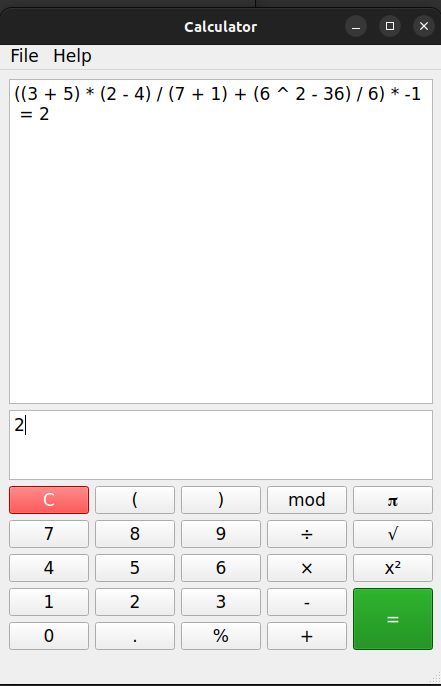
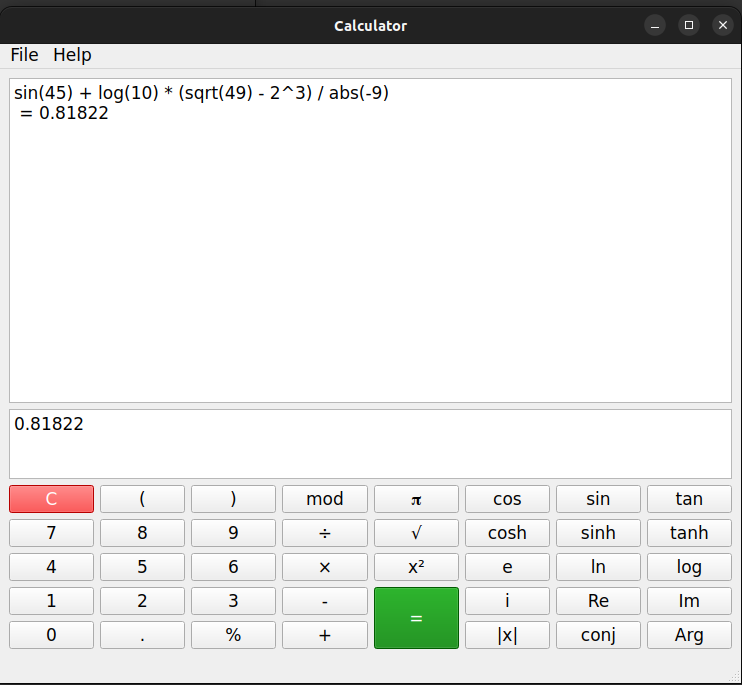

<h1 align="center"> Caculator-qt-linux </h1>

## Install
See in releases.
## Demo
- ***Origin calculator:***

 

- ***Full calculator:***

 
## AppImage Build

### ✅ BƯỚC 1: **Build app ra thư mục AppDir (giả sử bạn build CMake ra build/)**

```bash
cd /home/quang/Projects/QT6/banPhimHost/build-banPhimHost-Desktop-Release
cmake --install . --prefix /home/quang/AppDir/usr

```

---

### ✅ BƯỚC 2: **Tạo file `.desktop`**

Tạo file `AppDir/banPhimHost.desktop`:

```bash
cat > AppDir/banPhimHost.desktop <<EOF
[Desktop Entry]
Type=Application
Name=BanPhimHost
Exec=usr/bin/banPhimHost
Icon=banphimhost
Categories=Utility;
EOF
```

---

### ✅ BƯỚC 3: **Thêm icon**

Giả sử icon của bạn là `banphimhost.png` kích thước 256x256:

```bash
mkdir -p AppDir/usr/share/icons/hicolor/256x256/apps
cp path/to/banphimhost.png AppDir/usr/share/icons/hicolor/256x256/apps/
```

> Đảm bảo tên file là `banphimhost.png`, trùng với `Icon=banphimhost` trong file `.desktop`.

---

### ✅ BƯỚC 4: **Tải và cấp quyền thực thi `linuxdeployqt`**

```bash
wget https://github.com/probonopd/linuxdeployqt/releases/download/continuous/linuxdeployqt-continuous-x86_64.AppImage
chmod +x linuxdeployqt-continuous-x86_64.AppImage
```

---

### ✅ BƯỚC 5: **Thêm Qt6 `qmake` vào PATH**

> Điều này rất quan trọng nếu bạn không dùng Qt6 cài từ hệ thống.

```bash
export PATH=/home/quang/qt6/host/bin:$PATH
```

---

### ✅ BƯỚC 6: **Chạy `linuxdeployqt`**

> Chạy từ thư mục chứa `AppDir`

```bash
./linuxdeployqt-continuous-x86_64.AppImage AppDir/usr/bin/banPhimHost -appimage
```

---

### ✅ BƯỚC 7: **Chạy thử AppImage**

```bash

./BanPhimHost-x86_64.AppImage
```
